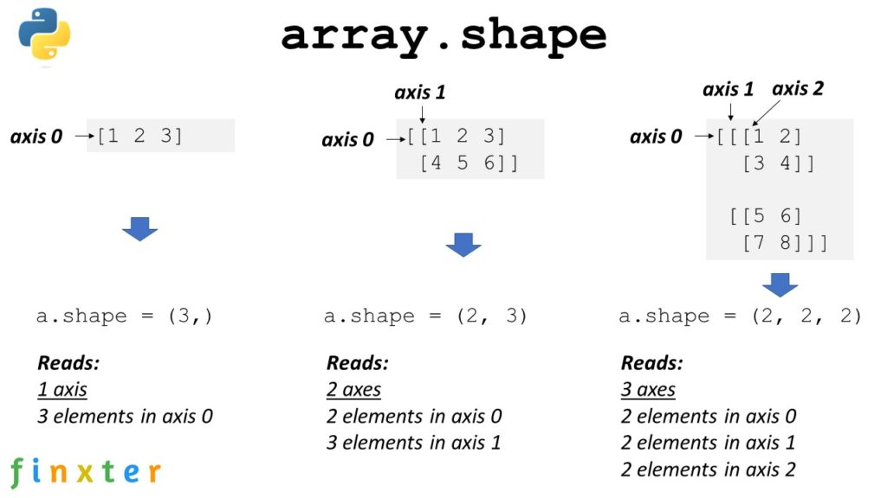

## 1.- ¿Qué es Pandas?

* Es una librería enfocada al análisis de datos.
* Es la librería más usada por Data Scientist.
* Se la usa en analítica, estadística, economía y análisis de lenguaje.
* Pandas viene de **PANel DAta**.
* Fue inventada en 2008 por Wes McKinney para analizar grandes volúmnenes de datos financieros.

**Ventajas** 
* Reduce líneas de código.
* Diseñada especialmente para el análisis.
* API fácil y concisa.
* Múltiples funciones.
  
**Desventajas**
* Incompatibilidad con matrices 3D.
* Curva de aprendizaje lenta.

_No es para estructuras mas complejas: matrices de mas de 3 dimensiones por ejemplo, en ese caso se recomienda numpy o numba_


## 2.- Primeros pasos con Google Colab

|[Mi Notebook de clase](My_notebooks/02_primeros_pasos.ipynb)  |  [Notebook del profe](/Notebooks/01_primeros_pasos.ipynb) |
|---------| ----:|

---


**Listas:** cadenas estructuradas de elementos
Las Listas de python carene de la habilidad de hacer operaciones matemáticas. no hay operaciones entre listas en python, si se hace una suma de listas, se concatenará. 
```python
[1,2,3,4,5] + [10]
#[1, 2, 3, 4, 5, 10]
```

Para hacer operaciones entre listas se puede usar **Numpy**.

En Numpy las dimensiones se llaman _ejes/axis_

Para definir un arreglo en Numpy se usa `.array()`, sobre éste arreglo se le puede aplicar una suma que sumará el valor a cada elemento 

```python
np.array([1,2,3,4,5]) +10
```
- La lista va entre paréntesis

Para saber las dimensiones del array se usa `.shape`

```python
np.array([[1,2,3,4],[6,7,8,9]]).shape
#(2, 4)
```
- para agregar mas dimensiones, se pueden usar mas de un corchete cuadrado sin comas intermedias




## 3.- Series e indexación y selección de datos

|[Mi Notebook de clase](My_notebooks/03_series.ipynb)  |  [Notebook del profe](/Notebooks/01_primeros_pasos.ipynb) |
|---------| ----:|

---


Pandas cuenta con objetos tipo Series, son una especie de vectores pero con una columna de indexación. se definen usando `.Series()` con **S** mayúscula.

* Dentro del paréntesis se puede colocar una lista lo que creará un objeto tipo serie.

Para verificar el tipo usamos `type(<objeto>)`.

### Métodos de Series


- `serie.values` --> devuelve los valores --> objeto tipo numpy, es un vector
- `serie.index` --> devuelve el rango si es sólo un vector, o los índices si éstos ya están personalizados.
- `serie.shape` --> la dimensión

### Indices

para acceder a un elemento usamos el doble corechete cuadrado, además podemos acceder a múltiples índices.

```python
mi_serie[[0,4,2]]
#serán elegidos en el orden que decidamos
```

Podemos cambiar el nombre de los índices para que no sea numérico, definiendo **una lista de índices**

```python
mi_serie = pd.Series([10,9,8,7,6], index = ['a','b','c','d','e'])
```

Podemos también usar slices **usando sólo un corchete cuadrado**

```python
mi_serie['b':'e']
```

Se pueden crear series de pandas con diccionarios, para así asignar nombres/valores a los  índices. En un caso sencillo el valor de los indices será el valor de las llaves.

```python
pd.Series({'CO':57, 'ECU':593, 'USA':1, 'UY':598, 'MX':200})
```

Si tenemos un diccionario, podemos crear una serie seleccionando las llaves que deseemos, en caso de que una llave no exista, se generará un valor NaN

```python
pd.Series(dict_data, index=['CO','MX','PE'])
```


**NOTAS**

- si usamos `.keys()` se mostrará el valor de las llaver en el orden en el que se introdujeron los elementos.
- Cualquier operación que se haga sobre una variable Nula(NaN), dará como resultado NaN
